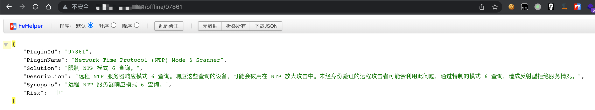
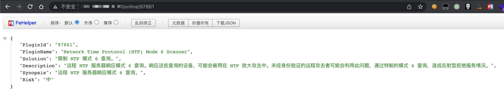
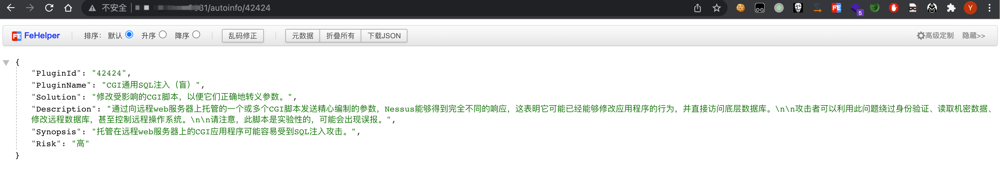
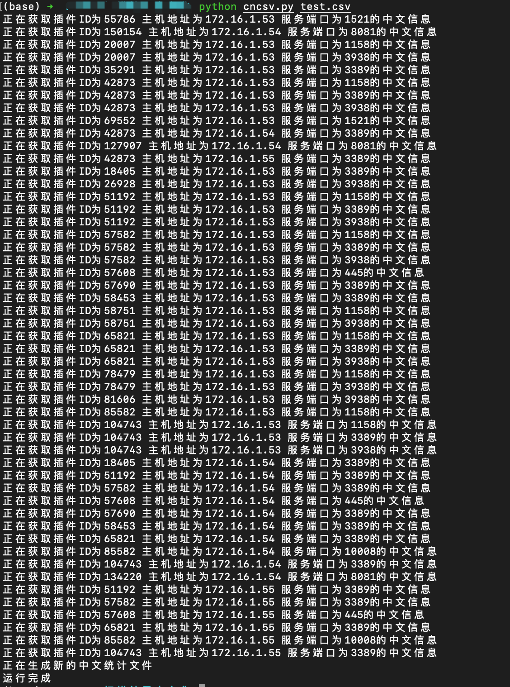
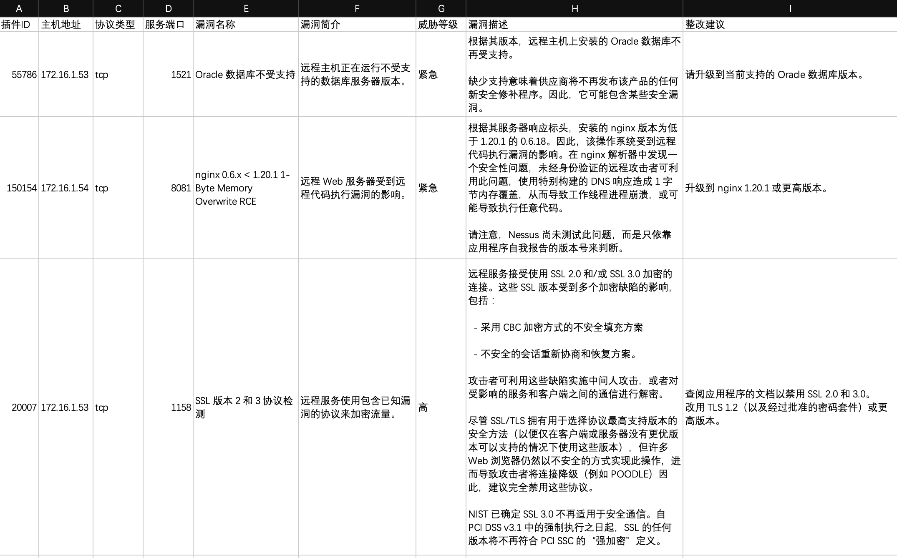

# 目前已有的NESSUS结果汉化方式
1. 采用人工创建的插件中文信息数据库来进行汉化
    - 优点：汉化结果准确
    - 缺点：中文信息库量小，大量插件或新出插件没有中文数据，数据库更新、同步、团队分享是个问题
2. 使用谷歌、百度翻译进行在线及时翻译
    - 优点：所有插件信息都可以进行汉化
    - 缺点：必须联网、机器翻译效果难以接受

# 本工具一些特点
1. 大量数据来自Nessus官方中文文档，翻译效果应该算比较好。
2. 支持插件中文信息库、官方中文文档在线查询、百度翻译三种方式返回结果。
3. 以接口方式返回json数据，使用者利用接口可根据需求生成自己想要的中文报告。  
   提供一个简单demo供大家参考，请查看cncsv.py文件
4. 方便团队内部维护维护、更新、使用中文数据库。

# 使用说明
* 程序运行后会检测当前目录下是否存在config.yml配置文件，如不存在会自动创建
  config.yml配置文件有4个参数需要配置：  
  |参数名|参数值|默认值|
  |----|----|----|
  |port|端口号|8081|
  |db|中文数据库文件|plugins.db|
  |baidukey|百度翻译api-key|空|
  |baiduappid|百度翻译api-id|空|
其中百度翻译的api-key和id可以自己去申请，免费的标准版即可。这里提供一个网上的教程地址给大家参考：  
  <https://jingyan.baidu.com/article/3f16e00305bb552591c10304.html>
* 离线查询模式：使用本地中文信息库进行查询并返回结果，适用于离线环境或大量自行维护数据时使用
  可使用我提供的plugin.7z，下载后解压，标准的sqlite3,后期可自行维护。
    - 优点：翻译速度快，不用联网
    - 缺点：数据库内容不及在线丰富
    - 使用方法：
      `http://url/offline/pluginid`  
      

* 在线查询模式：远程访问nessus官方地址获取数据，处理后再通过接口进行返回。
    - 优点：官方中文信息，同时兼具准确性和汉化数量
    - 缺点：必须网络可正常访问到nessus官方网站，网络状态可能影响返回结果；官方数据接口调整后可能影响该查询方式
    - 使用方法：
      `http://url/online/pluginid`  
      

* 自动查询模式：优先使用离线查询模式，如果没有结果则使用在线查询模式，如果还是没有结果则启用百度翻译自动翻译官方的英文说明
    - 优点：必然会返回中文结果信息
    - 缺点：必须网络可正常访问百度翻译接口，网络状态可能影响返回结果；多次调用查询，速度慢。
    - 使用方法：
      `http://url/autoinfo/pluginid`  
      

* demo效果展示
  

